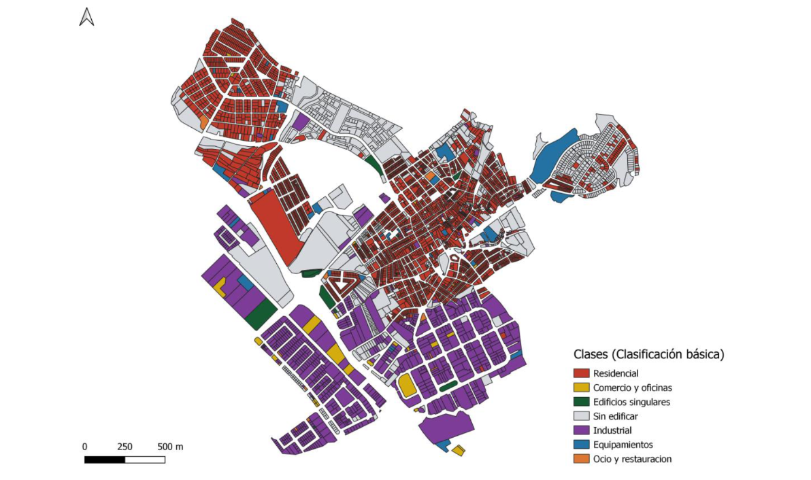
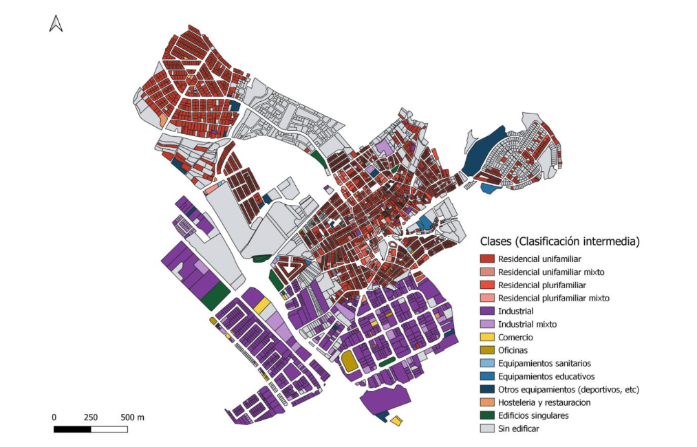
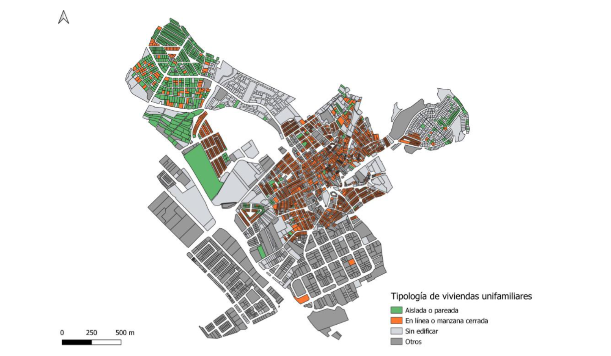

### Cadastral clasiffier

### Main Problem

La base de datos del catastro ofrece una información muy detallada y de actualización continua, de la que es posible derivar información de uso y cobertura del suelo. Sin embargo, esta información presenta una gran complejidad a la hora de su explotación, viéndose su uso limitado por el elevado nivel de conocimiento técnico necesario para manejarla. Esta dificultad radica en la propia complejidad del modelo de datos del catastro, y en el hecho de que la información temática está estructurada mediante numerosas tablas de datos con distintas relaciones entre ellas, que en última instancia se plasman en un único fichero con formato propio (*.CAT).   

### Cadastral Classifier Solution 

 El Clasificador Catastral (CC) permite clasificar de manera sencilla las parcelas catastrales en un conjunto de categorías de uso de suelo urbano, en función de los diferentes tipos de bienes inmuebles existentes y sus porcentajes de ocupación, con el objetivo de poder generar clasificaciones flexibles, y ajustadas a la máxima resolución temporal.  

El clasificador requiere como datos de partida la cartografía catastral (geometrías) y las tablas alfanuméricas descargables desde el portal de la [DGC](http://www.sedecatastro.gob.es/) para cualquier municipio de España (excepto la C.F de Navarra y el País Vasco).  

El plugin está diseñado considerando un espectro amplio de usuarios, y por este motivo ofrece tres tipos de clasificaciones parcelarias con un creciente nivel de complejidad (clasificación básica con 6 usos, intermedia con 14, y avanzada, totalmente personalizable por el usuario).  

**1- Basic classification**: The classifier aggregates land uses into six different predefined classes.
  
  

[Full size picture](./basic.html)

**2- Intermediate classification**: Up to 14 classes, and options for the user to define the threshold value to define four classes (Residencia unifamiliar, Residencia plurifamiliar, Industrial mixto, y edificaciones)

[Full size picture](./intermediate.html)

**3- Advance classification**: Complete control to users to customize classes based on the percentage of area covered by each land use.

[Full size picture](./advance.html)

Check the Manual for a complete description of how to work with the Cadastral Classifier: [Manual](https://github.com/TransUrban-UAH/Cadastral_Classifier/blob/main/manual_de_usuario.pdf)

[back](./)