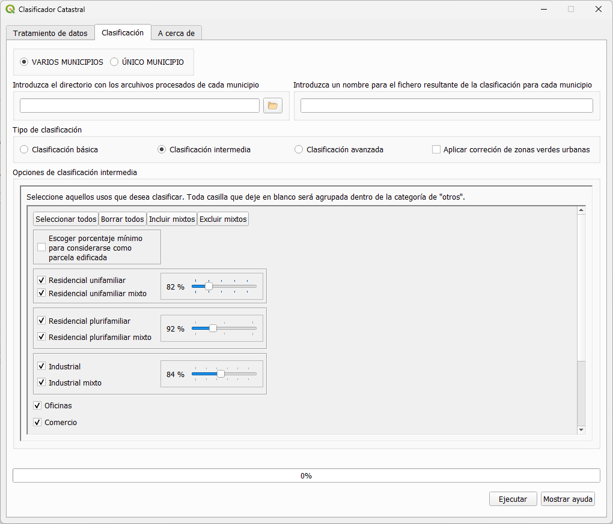
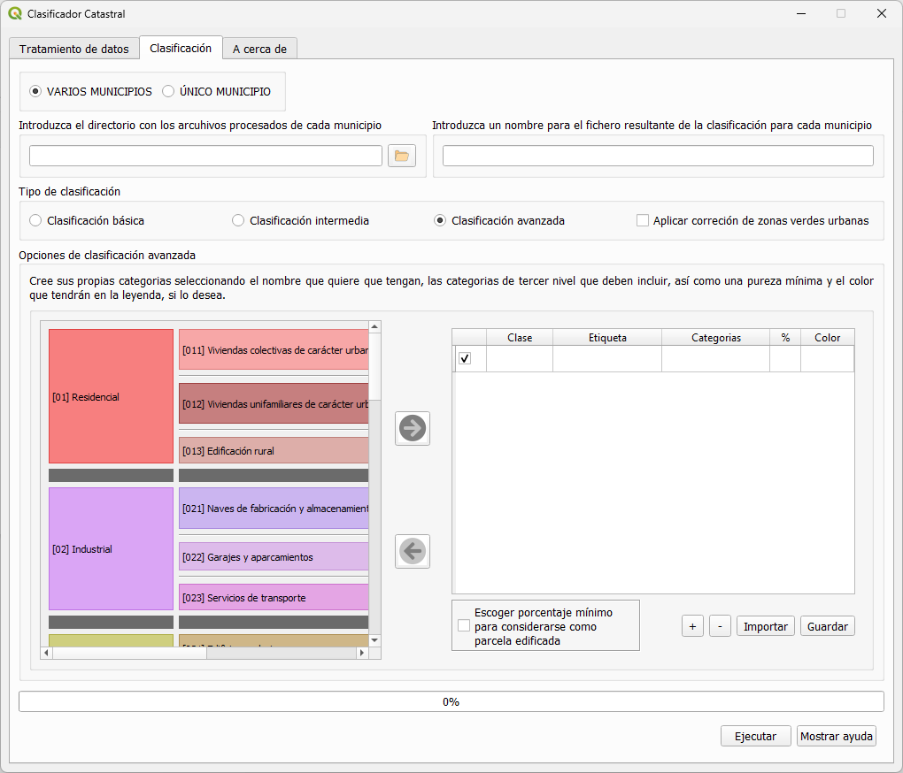

### Cadastral clasiffier

### Main Problem

The cadastre database offers detailed and continuously updated data, from which it is possible to derive land use and land cover. However, the high technical knowledge required to handle this database limits its use. This difficulty lies in the complexity of the cadastre data model itself, and in the fact that the thematic data is structured by means of numerous data tables with different relationships between them, which are ultimately captured in a single file with its own format (*.CAT).  

### Cadastral Classifier Solution 

The Cadastral Classifier (CC) allows a simple classification of cadastral parcels into a set of urban land use categories, according to the different types of existing real estate and their occupancy percentages, with the objective of generating flexible classifications, and adjusted to the maximum temporal resolution.     

The classifier requires as starting data the cadastral cartography (geometries) and alphanumeric tables downloadable from the portal of the [DGC](http://www.sedecatastro.gob.es/) for any municipality in Spain (except the C.F. of Navarra and the Basque Country).  

The plugin is designed considering a broad spectrum of users, and for this reason it offers three types of parcel classifications with an increasing level of complexity (basic classification with 6 uses, intermediate with 14, and advanced, fully customizable by the user).  

**1- Basic classification**: The classifier aggregates land uses into six different predefined classes.
  
 

**Basic classification municipality of Peligros**

**2- Intermediate classification**: Up to 14 classes, and options for the user to define the threshold value to define four classes (Single-family residential, multi-family residential, mixed industrial, and commercial buildings).

**Intermediate classification municipality of Peligros**

**3- Advance classification**: Complete control to users to customize classes based on the percentage of area covered by each land use.

**Advanced classification municipality of Peligros**

Check the Manual for a complete description of how to work with the Cadastral Classifier: [Manual](https://github.com/TransUrban-UAH/Cadastral_Classifier/blob/main/manual_de_usuario.pdf)

[back](./)