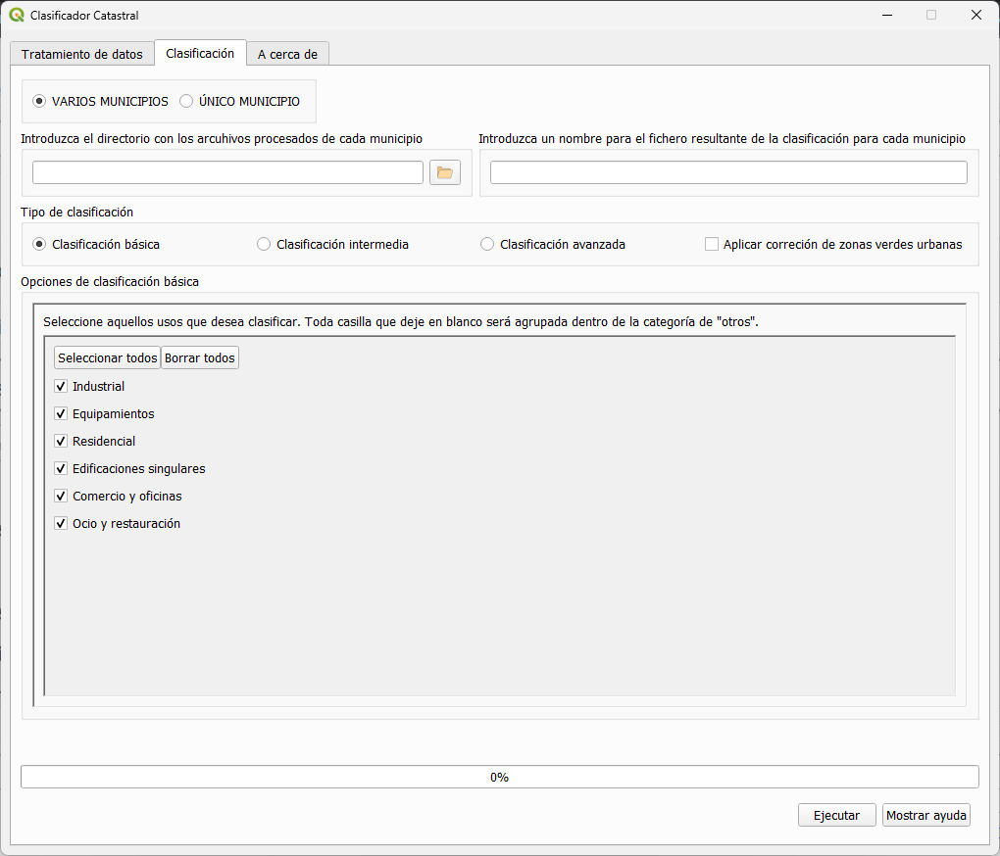

### Cadastral Classifier

### Main Problem

The cadastre database offers detailed and continuously updated data, from which it is possible to derive land use and land cover. However, the high technical knowledge required to handle this database limits its use. This difficulty lies in the cadastre data model's complexity and thematic data structure, which includes numerous data tables with different relationships between them, which are ultimately captured in a single file with its own format (*.CAT).  

### Cadastral Classifier Solution 

The Cadastral Classifier (CC) allows a simple classification of cadastral parcels into a set of urban land use categories, according to the different types of existing real estate and their occupancy percentages, to generate flexible classifications and adjust to the maximum temporal resolution. 

The classifier requires data from the cadastral cartography (geometries) and alphanumeric tables, both available for any municipality in Spain (except the C.F. of Navarra and the Basque Country) and downloadable from the portal of the [DGC](http://www.sedecatastro.gob.es/)  

The plugin has been designed considering a broad spectrum of users. For this reason, it offers three types of parcel classifications with an increasing level of complexity (basic classification with 6 uses, intermediate with 14, and advanced, fully customizable by the user).

**1- Basic classification**: The classifier aggregates land uses into six different predefined classes.
  
 

**Basic classification municipality of Peligros**

**2- Intermediate classification**: The classifier aggregates land uses up to 14 classes. Additionally, it provides further options to enter a threshold value to customize four of these classes (Single-family residential, multi-family residential, mixed industrial, and commercial buildings).

**Intermediate classification municipality of Peligros**

**3- Advance classification**: The classifier aggregates land use classes following definitions provided by the user based on the percentage of area covered by each land use within each parcel.

**Advanced classification municipality of Peligros**

See the handbook for a complete description of how to work with the Cadastral Classifier: [Handbook](https://github.com/TransUrban-UAH/Cadastral_Classifier/blob/main/manual_de_usuario.pdf)

[back](./)