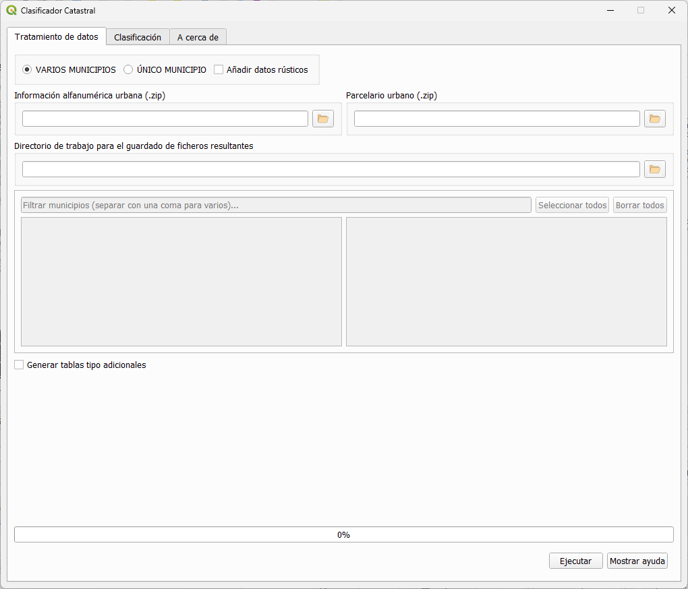
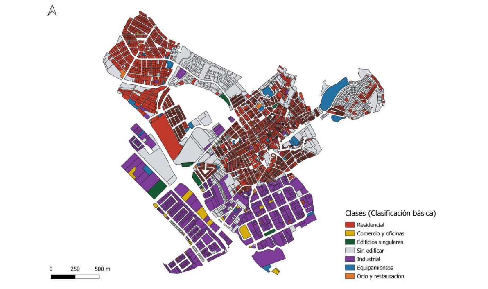

### Clasificador Catastral

### Problema

La base de datos del catastro ofrece una información muy detallada y de actualización continua, de la que es posible derivar información de uso y cobertura del suelo. Sin embargo, esta información presenta una gran complejidad a la hora de su explotación, viéndose su uso limitado por el elevado nivel de conocimiento técnico necesario para manejarla. Esta dificultad radica en la propia complejidad del modelo de datos del catastro, y en el hecho de que la información temática está estructurada mediante numerosas tablas de datos con distintas relaciones entre ellas, que en última instancia, se plasman en un único fichero con formato propio (*.CAT).   

### Solución propuesta por el Clasificador Catastral

 El **Clasificador Catastral (CC)** permite clasificar de manera sencilla las parcelas catastrales en un conjunto de categorías de uso de suelo urbano, en función de los diferentes tipos de bienes inmuebles existentes y sus porcentajes de ocupación, con el objetivo de poder generar clasificaciones flexibles, y ajustadas a la máxima resolución temporal.  

El clasificador requiere como datos de partida la cartografía catastral (geometrías), y las tablas alfanuméricas descargables desde el portal de la [DGC](http://www.sedecatastro.gob.es/) que se encuentran disponibles para cualquier municipio de España (excepto la C.F de Navarra y el País Vasco).  

El complemento está diseñado considerando un espectro amplio de usuarios, y por este motivo ofrece tres tipos de clasificaciones parcelarias que muestran un creciente nivel de complejidad (clasificación básica con 6 usos, intermedia con 14, y avanzada, totalmente personalizable por el usuario).  

**1- Clasificación Básica:** Se clasifican los usos del suelo en seis diferentes clases predefinidas.
  

**Clasificación básica municipalidad de Peligros**

 **2- Clasificación Intermedia:** Se clasifican los usos del suelo en hasta 14 clases. Adicionalmente, el usuario puede establecer un valor umbral para definir 4 de estas clases. (Residencia unifamiliar, Residencia plurifamiliar, Industrial mixto, y edificaciones).

**Clasificación intermedia municipalidad de Peligros**

**3- Clasificación Avanzada:** Control completo a los usuarios para definir las clases basado en el % de cobertura de cada uso del suelo.  

**Clasificación avanzada municipalidad de Peligros**

Revisa el manual para obtener una descripción completa de como trabajar con el Clasificador Catastral: [Manual](https://github.com/TransUrban-UAH/Cadastral_Classifier/blob/main/manual_de_usuario.pdf)

[Volver](./)